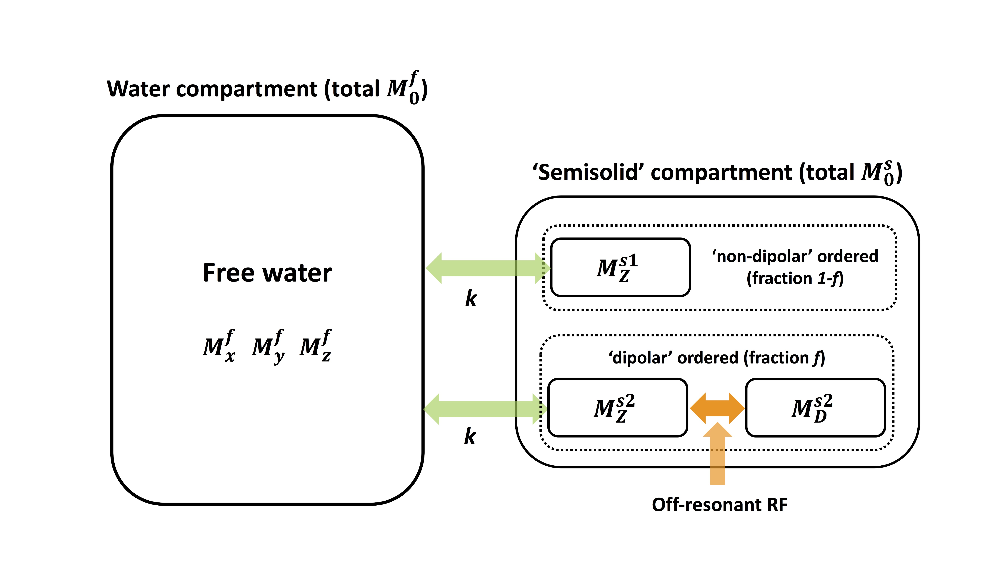

# Steady-state ihMT sequences using multiband pulses
This software can be used for simulating the steady-state of bSSFP and SPGR MRI sequences
when employing multi-band pulses in tissues with [inhomogeneous MT effects](https://onlinelibrary.wiley.com/doi/full/10.1002/mrm.25174)
and builds on prior work using non-selective multi-band RF pulses for [controlling saturation of MT effects](https://onlinelibrary.wiley.com/doi/10.1002/mrm.27442).

A paper describing the theory and experiments implemented in this repo is currently under
review and links will be posted as soon as it is published. A related abstract was presented at [ISMRM 2019 (#427)](https://cds.ismrm.org/protected/19MPresentations/abstracts/0427.html)

**This code is distributed under the GNU General Public License v3 (see the included [LICENSE](LICENSE.txt)). Please cite our work appropriately if you use it and link any extensions back to this repo**

    
    
This code has been tested using Matlab R2018b. Please get in touch to report any bugs.
    
    
Shaihan Malik, King's College London, June 2019.
[@shaihanmalik](https://twitter.com/shaihanmalik)

## Biophysical model

The code implements the model described by the following diagram:

Tissue consists of a main compartment of free water, and two semisolid compartments s1 and s2
that are both in contact with the free water pool but not each other. Compartment s1 consists
only of Zeeman ordered magnetization, while s2 contains both Zeeman and Dipolar ordered terms. The 
relative fractions of these are _f_ and _(1-f)_ respectively. 

Tissue properties are contained within a struct `tissuepars` which is constructed as follows:
	
	
	tissuepars.
				free.
					R1 <----- Free pool longitudinal relaxation rate R1 (s^-1)
					R2 <----- Free pool transverse relaxation rate R2 (s^-1)
				semi.
					M0 <----- Semisolid fraction of M0 (i.e. M0s in paper)
					R1 <----- Semisolid Zeeman longitudinal relaxation rate (R1Z, s^-1)
					R1D<----- Semisolid Dipolar longitudinal relaxation rate (R1D, s^-1)
					T2 <----- Semisolid Transverse relaxation TIME (s)
					f  <----- fraction of semisolid pool in compartment s2
				k	   <----- exchange rate between free and semisolid pools (directionless; s^-1)
				lineshape <-- Flag that decides lineshape model, either 'SL' (Super Lorentzian) or 'Gaussian'

_&dagger; The symbol 'f' will be replaced by '&delta;' in a future revision_

Tissues can be initialised by calling function `init_tissue`:

* `init_tissue.m`

  Takes a string argument, current options:
  - 'ic' (internal capsule model from Mchinda et al 2017)
  - 'pl161' prolipid 161, using data from paper
  - 'simple' simplified rounded parameter values, similar to human brain

The `tissuepars` struct contains a flag for the lineshape. The lineshapes are implemented by two separate functions 
`SuperLorentzian_lineshape` or `gauss_lineshape`. 
  
  
* `SuperLorentzian_lineshape.m`
    
    
        [G,w_loc] = SuperLorentzian_lineshape(T2s,fsample,varargin)
        
        INPUTS:     T2s = T2 of semisolid compartment, seconds
                    fsample   = frequencies at which function is to be evaluated (can
                    be vector)
                    optional: 'interpzero' - interpolate between ±1.5kHz as per
                    Gloor et al 2008, to remove high peak at f=0.
        
        OUTPUTS:    G   = lineshape value, s
                    w_loc = local field term (rad/s)

The 'interpzero' flag is used to interpolate across the zero frequency term which has a singularity. This approach 
was proposed by [Bieri and Scheffler](https://doi.org/10.1002/mrm.21056) and also used by [Gloor et al 2008](https://onlinelibrary.wiley.com/doi/full/10.1002/mrm.21705)

* `gauss_lineshape.m`
    
    
         [g,w_loc] = gauss_lineshape(T2s,f)
         
         INPUTS:       T2s = T2 of semisolid compartment, seconds
                       f   = frequency at which function is to be evaluated (can
                       be vector)
         OUTPUTS:      g   = lineshape value, s
                       w_loc = local field term (rad/s)
                       

    
## RF pulses

The work that this code relates to uses multiband RF pulses for simultaneous saturation and excitation. 
These pulses may be designed to have equal RF power that is distributed differently (as needed) over one, two, or 
three different frequency bands with offset frequencies &Delta;.

The illustration shows three different pulses all with the same total power. These can be 
generated using `gen_MB_pulse.m`:

* `gen_MB_pulse.m`

  This function will generate multiband pulses which produce a required on-resonance flip angle
  (&theta;) for a specified pulse duration &tau; and TR that has a given specific total RMS B1.
  As in the diagram above, these could either have 2 or 3 bands (single or dual off-resonance frequency). 
  The 2-band pulses can have either a positive or negative offset; the names of the pulses are therefore
  2+B, 2-B, 3B.
  
  
   
      [pulseMB, b1sqrd, pulse_per_band,TBP] = gen_MB_pulse(theta,tau,TR,b1rms_total,delta,nband,varargin)
      
      arguments:
      -  theta:         on-resonance flip angle (rad)
      -  tau:           pulse duration (s)
      -  TR:            repetition time (s)
      -  b1rms_total:   overall RMS B1 of the whole sequence (uT)
      -  delta:         offset frequency for off-resonant bands (Hz) 
      -  nband:         string argument for number of bands. Options are '2+', '2-', or '3'.
      
      optional arguments:
      -  alpha:         scalar value determining width of Gaussian envelope for pulse (default is 3)
      -  dt:            RF sampling duration. Default 6.4us

## Simulation code

The main simulation functions are contained within the `src` folder. Details of the implementations are given in 
an upcoming paper, link to be added when available. Most functions assume that there are 3 frequency bands that need to be considered
though some may have zero contribution. This could be readily extended if necessary.

*   `ssSSFP_ihMT.m` - Direct simulation of *steady state* for balanced SSFP sequence under **instantaneous RF pulse approximation** (i.e. 
    relaxation and exchange are neglected during RF pulses, pulses are applied instantaneously).
    
    
        function [Mss,Mz] = ssSSFP_ihMT(flipangle,b1sqrd,Delta_Hz,TR,tau,dphi, tissuepars,varargin)
    
        Steady-state ihMT bSSFP sequence. For non-selective multiband sequences
    
        INPUTS:         
           flipangle  = flip angle on resonance (rad)
           b1sqrd     = mean square B1+ per frequency band of
                        multiband pulse (over the duration of the pulse). 
                        1x3 vector (so far we assume 3 bands maximum but 
                        this could be changed). Units uT^2
           Delta_Hz   = 1x3 vector of frequencies of each band. Typically 
                        [-delta 0 delta]. Units Hz
           TR         = repetition time, sec
           tau        = pulse duration, sec
           dphi       = Off-resonance phase gained per TR, unit=radians
           tissuepars = structure containing all tissue parameters. See
                        init_tissue()
        OUTPUTS:
           Mss        = Steady-state Mxy (after excitation pulse)
           Mz         = Longitudinal magnetization, including semisolid
                        terms

This code will directly compute the steady-state for bSSFP. The argument b1sqrd is the mean square B1 
in each frequency band over the pulse duration (not TR). This is output by the `gen_MB_pulse` function. 
The tissue properties are passed to this function using the struct that is initialised by `init_tissue`. The 
absorption line is computed within this function, using the flag `tissuepars.lineshape` to decide which function to use. 
If the Super-Lorentzian is used then the `interpzero` option is also used here.
    
    
-   `ssSPGR_ihMT.m` - Identical functionality to `ssSSFP_ihMT.m` except for SPGR sequence, the only difference is that the argument `dphi` is not
    needed. Perfect spoiling of transverse components is assumed.
    
    
-   `ssSSFP_ihMT_integrate.m` - Integration method for direct computation of steady-state for bSSFP without assuming instantaneous pulses. 
    Uses eigenvector based method for steady-state computation (see paper when available).
    
    
            function [Mss,Mz] = ssSSFP_ihMT_integrate(b1pulse,dt,Delta_Hz,TR,dphi, tissuepars)

           Steady-state ihMT bSSFP sequence with eigenvector based time integration method

        INPUTS:         
            b1pulse    = RF pulse, Mx3 array (M=#timepoints, 3=frequency
                         bands). Units are uT
            dt         = dwell time, sec
            Delta_Hz   = 1x3 vector of frequencies of each band. Typically 
                         [-delta 0 delta]. Units Hz
            TR         = repetition time, sec
            dphi       = off-resonance phase per TR (rad)
            tissuepars = structure containing all tissue parameters. See
                        init_tissue()
    
        OUTPUTS:
            Mss        = Steady-state Mxy (after excitation pulse)
            Mz         = Longitudinal magnetization, including semisolid
                                terms

Note that unlike `ssSSFP_ihMT.m` this function takes the sampled RF waveform, decomposed into separate frequency bands in the time domain. 
The flip angle and b1rms therefore do not need to be defined.

-   `ssSPGR_ihMT_integrate.m` - Identical functionality to `ssSSFP_ihMT_integrate.m` except for SPGR sequence, the only difference is that the argument `dphi` is not
    needed. Perfect spoiling of transverse components is assumed.
    
    
-   `Bieri_Scheffler_finite_correction.m` - implements finite RF pulse duration correction to R2 of the free water pool for bSSFP 
    as outlined [in this paper](https://onlinelibrary.wiley.com/doi/full/10.1002/mrm.22116). We assume pulses have a Gaussian envelope as generated
    by `gen_MB_pulse` - the user supplies the time-bandwidth-product (TBP) needed for this correction. Takes a `tissuepars` struct and returns a copy with 
    modified `tissuepars.free.R2`.
    
    
## Experiments

The scripts in the folder `experiments` may be used to replicate certain experiments. Make sure the `lib` and `src` subfolders are on the path
before executing these.

#### Compare ihMT effect for different sequences in white matter
Uses `white_matter_ihMT_comparisons.m`. This script performs the following tests:
-   Simulate expected signal curves for 1B, 2B and 3B pulses in WM for case where f=0 and f=1, for SPGR and bSSFP
-   Display ihMTR and MTR for the same sequences
-   Explore &Delta;ihMT and ihMTR for bSSFP with variable &Delta;, b1rms, &theta;
-   Investigate limits for pulse design using `gen_MB_pulse` within hardware and safety constraints
    
    
#### Investigate instantaneous pulse approximation
Uses `instantaneous_pulse_approx_script.m`. This script compares simulations using the instantaneous approximation (i.e. `ssSSFP_ihMT` 
and `ssSPGR_ihMT`) with temporal integration including the shaped RF waveforms (i.e. `ssSSFP_ihMT_integrate` and `ssSPGR_ihMT_integrate` respectively). 
Comparisons are made for different dipolar relaxation times (R1D) and pulse durations, and it is shown that the [Bieri Scheffler correction]((https://onlinelibrary.wiley.com/doi/full/10.1002/mrm.22116))
is enough to correct the instantaneous approximation results in most cases. The script also compares the eigenvector based method for finding the steady-state 
used in `ssSSFP_ihMT_integrate` and `ssSPGR_ihMT_integrate` with time-integration over multiple TR periods to reach the steady-state.

	
Our proposed time integration method is unlike other approaches which simply run a Bloch (or Bloch-McConnell) simulation 
over many TR periods in order to reach the steady-state; instead we use an eigenvalue approach that directly computes
the steady-state after integrating over one TR period. In this script we have also run a simple comparison with this
method which is referred to as 'MAMT' after [this paper by Portnoy and Stanisz](https://onlinelibrary.wiley.com/doi/full/10.1002/mrm.21244). 
This result was not included in the paper. The comparison shows that the relative benefit of the proposed direct integration method scales linearly with the number of TR periods
that are simulated. 
	

	
	
For the white matter example shown here the required number of TR periods to reach very low error is approximately 400 
and for this length of simulation the relative speed-up from the eigenvalue method is a factor of approximately 300.
  
      
#### Experimental data fitting
Experiments were performed using SPGR and bSSFP with a range of flip angles on a sample consisting of:
-   Water doped win MnCl2, not expected to have MT or ihMT effect
-   Bovine Serum Albumin, expected to have MT but not ihMT contrast
-   Prolipid 161, used as a test substance for ihMT effects by [Swanson et al](https://onlinelibrary.wiley.com/doi/full/10.1002/mrm.26210)
-   Hair conditioner, also shown to have ihMT effect (e.g. by [Varma et al](https://onlinelibrary.wiley.com/doi/full/10.1002/mrm.25174))
    
Phantom data are available to download from the release page, please place the matrix `fitdata.mat` into the `bin` folder. This script will performed constrained fitting to this 
data using the above listed signal functions and perform error analysis using residual bootstrapping.
    
    
#### Other scripts
- `MB_figure_script.m` generates the figure with the example RF waveforms used above
- `single_pool_comparison_noMT.m` compares the signal functions with Ernst and Freeman-Hill equations for the case of no semisolid compartment
